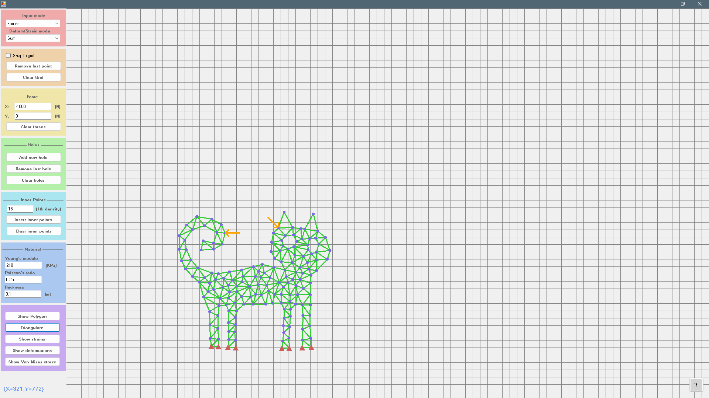
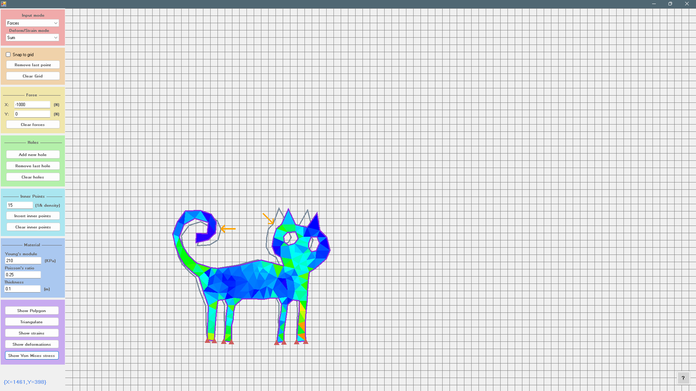
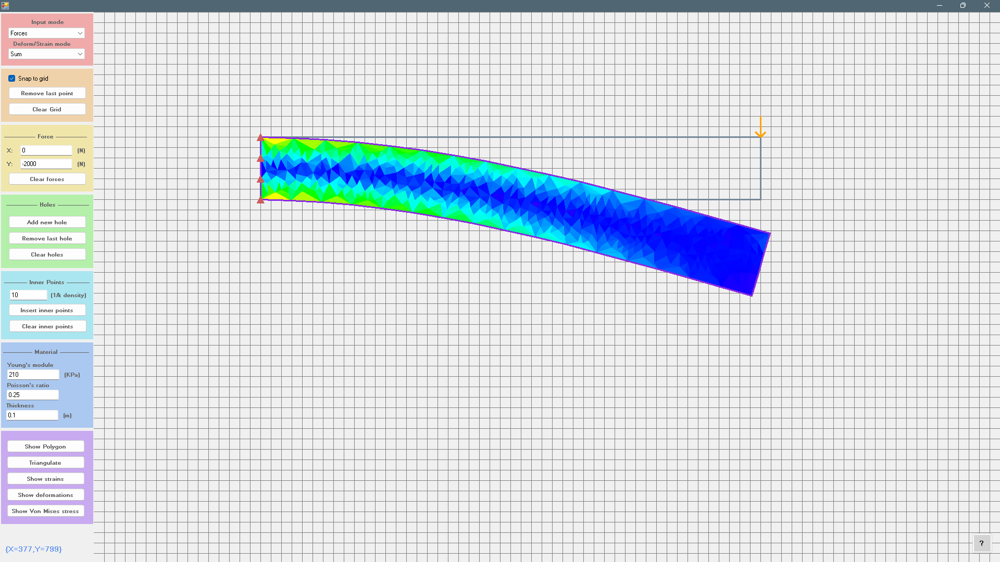

# Finite Element Method Editor 2D
A simple WinForms program that allows you to draw a 2D shape (with holes), triangulate it and calculate displacements/strains/von_Mises_stresses.
There are no optimizations and the math is simplified as much as possible, so calculations may take some time.

### Application Controls
#### Red panel
Inupt modes:
1. None - does nothing.
2. Points - LMC to add normal point, RMC to add fixed point.
3. Holes - LMC to add normal point, RMC to add fixed point. When you finish entering current hole click on 'Add new hole' (Green panel).
4. Forces - LMC to add new force. Input force parameters in yellow panel.

Deform/Strain modes:
1. Sum - use to show sum of deforms/strains.
2. One - use to show first deforms/strains.
3. Two - use to show second deforms/strains.
4. Three - use to show third deforms/strains.
Before showing deforms/strains you must calculate it. Use violet panel.

#### Orange panel
Additional interface functions:
1. Snap to grid - use to snap every placed point (applies on boundary points, forces and holes).
2. Remove last point - use to remove last entered boundary point.
3. Clear Grid - use to clear everything on screen.

#### Yellow panel
Forces settings:
1. X - force magnitude in newtons on X axe.
2. Y - force magnitude in newtons on Y axe.
3. Clear forces - use to clear all forces.

#### Green panel
Holes settings:
1. Add new hole - use to add new entered hole. When hole is not entered it's green, when entered it's blue.
2. Remove last hole - use to remove last hole (entered or not entered).
3. Clear holes - use to clear all holes (entered or not entered).

#### Light blue panel
Inner points settings:
1. Density field - enter necessary density value in format: '1 point / k pixels' where k is entered value.
2. Insert inner points - use to insert points into the polygon boundary. It placees from 1 to 1000 points by density value as much as possible.
3. Clear inner points - use to clear all points inside the polygon boundary (except holes).

#### Blue panel
Material settings:
1. Young's module - value characterizing the ability of a material to resist stretching and compression during elastic deformation. Specified in kilopascals.
2. Poisson's ratio - value characterizing the ratio of transverse to longitudinal deformation.
3. Thickness - value characterizing the tickness of a flat plate. Specified in millimeters.

#### Violet panel
Main functions:
1. Show polygon - use to switch view back to polygon.
2. Triangulate - use to triangulate current polygon.
3. Show strains - use to calculate and show polygon displacements and strains.
4. Show deformations - use to calculate and show polygon displacements and deformations.
5. Show von Mises stress - use to calculate and show displacements and Von Mises stress.
